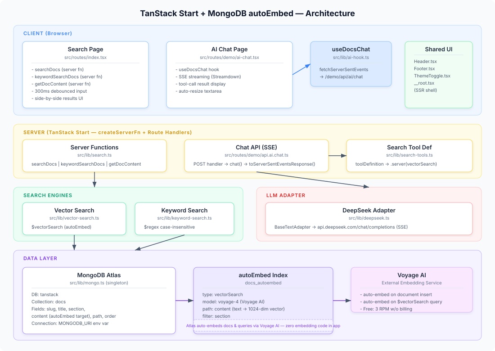

# TanStack Start + MongoDB autoEmbed

MongoDB Atlas autoEmbed (零代码向量嵌入) + TanStack Start 演示应用。提供关键词搜索与语义向量搜索的对比 UI,以及基于 RAG 的 AI 聊天界面。

A demo app showcasing **MongoDB Atlas autoEmbed** (zero-code vector embeddings) with **TanStack Start** — side-by-side keyword vs semantic vector search, plus an AI chat interface using RAG.



## Tech Stack

| Layer | Technology |
|-------|-----------|
| Framework | TanStack Start (SSR React) + TanStack Router (file-based routing) |
| Styling | Tailwind CSS 4 + custom CSS properties (light/dark/auto theme) |
| Database | MongoDB Atlas (Vector Search with autoEmbed) |
| Embedding Model | Voyage AI `voyage-4` (via Atlas autoEmbed — no app-side embedding code) |
| Chat LLM | DeepSeek (`deepseek-chat` via OpenAI-compatible SSE API) |
| AI Framework | TanStack AI (tool definitions, SSE streaming, chat hooks) |
| Markdown | gray-matter (frontmatter parsing), Streamdown (streaming render), highlight.js |
| Build | Vite 7 + TypeScript |

## Module Overview

| Module | Responsibility |
|--------|---------------|
| `src/routes/index.tsx` | Search page — side-by-side keyword vs vector search with debounced input |
| `src/routes/demo/ai-chat.tsx` | AI chat page — RAG-powered Q&A over TanStack AI docs |
| `src/routes/demo/api.ai.chat.ts` | Server-side SSE chat endpoint — orchestrates DeepSeek + searchDocs tool |
| `src/lib/search.ts` | Server functions (`createServerFn`) exposing search to the client |
| `src/lib/vector-search.ts` | `$vectorSearch` aggregation with autoEmbed (query text auto-embedded by Atlas) |
| `src/lib/keyword-search.ts` | Case-insensitive `$regex` text matching with title-boost scoring |
| `src/lib/search-tools.ts` | TanStack AI `toolDefinition` wrapping vector search for the chat agent |
| `src/lib/deepseek.ts` | Custom `BaseTextAdapter` implementing DeepSeek's SSE chat completions protocol |
| `src/lib/ai-hook.ts` | Client-side `useDocsChat` React hook using TanStack AI's SSE client |
| `src/lib/mongo.ts` | Singleton MongoClient, reads `MONGODB_URI` from env, auto-reconnects |
| `src/components/ThemeToggle.tsx` | Light/dark/auto theme toggle with localStorage persistence |
| `scripts/setup-atlas.ts` | One-shot: create collection + autoEmbed index on Atlas |
| `scripts/ingest.ts` | Walk markdown docs directory and upsert into MongoDB |

## Data Flow

```
1. Data Ingestion
   TanStack AI docs (.md) --[ingest.ts]--> MongoDB docs collection
                                                  |
                                            Atlas autoEmbed
                                                  |
                                          Voyage AI voyage-4
                                                  |
                                       _auto_embedding_content (hidden field)

2. Search Page (keyword vs vector)
   User query --[search.ts server fns]--> keywordSearch($regex)  --> results
                                       --> vectorSearch($vectorSearch)
                                                    |
                                              Atlas auto-embeds query text
                                                    |
                                              ANN search against stored vectors
                                                    |
                                              ranked results (score 0-1)

3. AI Chat (RAG)
   User question --> DeepSeek LLM
                        |
                   decides to search
                        |
                   searchDocsTool --> vectorSearch() --> doc results
                        |
                   DeepSeek synthesizes answer from retrieved docs
                        |
                   SSE stream back to client
```

## Quick Start

```bash
# Install dependencies
pnpm install

# Configure environment
# Create .env.local with:
#   DEEPSEEK_API_KEY=your_key
#   MONGODB_URI=mongodb+srv://...
```

### MongoDB Atlas Setup

```bash
# Create collection and autoEmbed vector search index
pnpm setup-atlas

# Ingest TanStack AI docs (auto-clones from GitHub)
pnpm ingest
```

### Development

```bash
# Dev server (port 3000)
pnpm dev

# Build for production
pnpm build

# Run tests
pnpm test
```

## Routes

| Route | Method | File | Description |
|-------|--------|------|-------------|
| `/` | GET | `src/routes/index.tsx` | Search page — keyword vs vector comparison |
| `/demo/ai-chat` | GET | `src/routes/demo/ai-chat.tsx` | AI chat with RAG |
| `/demo/api/ai/chat` | POST | `src/routes/demo/api.ai.chat.ts` | SSE chat endpoint |

## Environment Variables

| Variable | Required | Description |
|----------|----------|-------------|
| `DEEPSEEK_API_KEY` | Yes | DeepSeek API key for AI chat |
| `MONGODB_URI` | Yes | MongoDB Atlas connection string |

## Path Alias

`#/*` maps to `./src/*` (configured in `tsconfig.json` and `package.json` imports).
